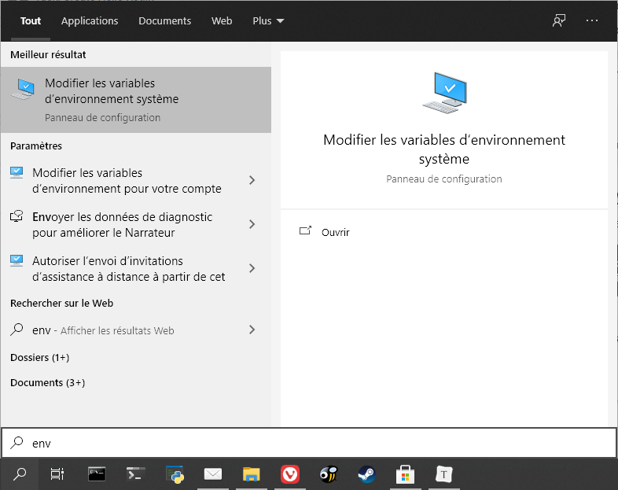
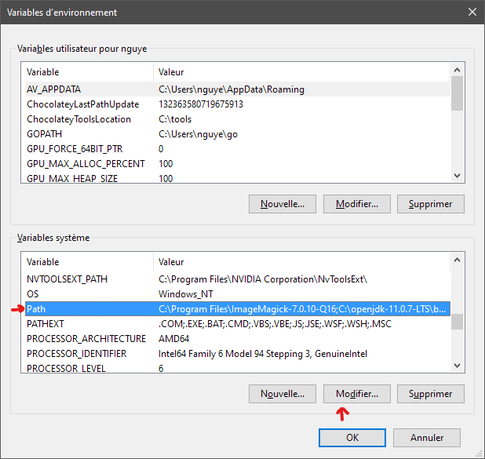
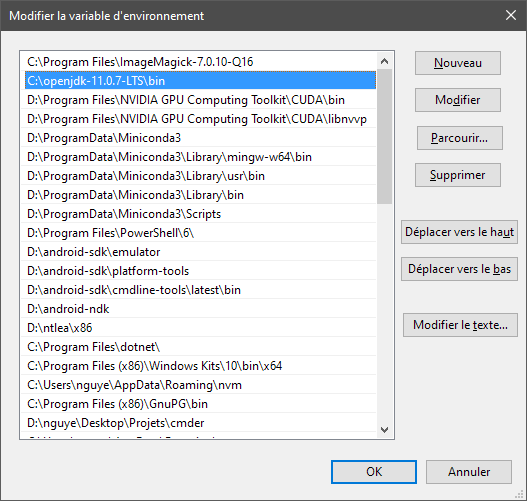
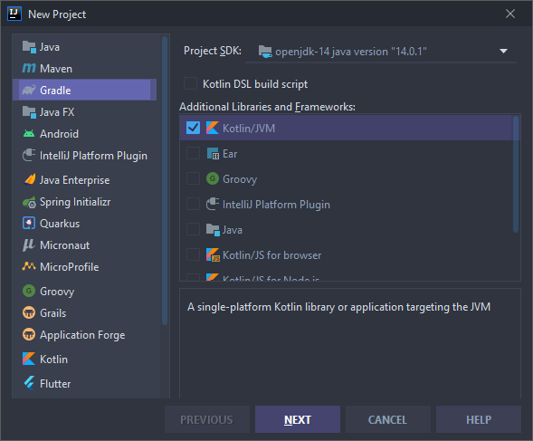
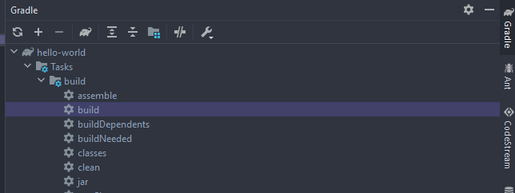
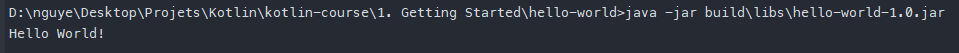

# 1. Get Started

## 1.1 Kotlin

Kotlin est un langage de programmation **multiplateforme**, à **typé statique** et à **inférence de type**. **Kotlin est conçu pour interagir pleinement avec Java**, et la version JVM de sa bibliothèque standard dépend de la bibliothèque de classes Java, mais l'inférence de type permet d'être plus concis dans sa syntaxe. Kotlin cible principalement la JVM, mais compile également en JavaScript ou en code natif (via la LLVM). Les coûts de développement du langage sont pris en charge par JetBrains, tandis que la Fondation Kotlin protège la marque Kotlin.

```kotlin
// Main.kt
fun main() {
    println("Hello World")
}
```

## 1.2 Java

Java est un langage de programmation polyvalent basé sur les **classes**, **orienté objet** et conçu pour avoir **le moins de dépendances d'implémentation** possible. Il est destiné à permettre aux développeurs d'applications **d'écrire une fois, d'exécuter n'importe où**, ce qui signifie que le code Java compilé peut s'exécuter sur toutes les plates-formes qui supportent Java sans qu'il soit nécessaire de le recompiler. 

Les applications Java sont généralement **compilées en bytecode** qui peut s'exécuter sur n'importe quelle machine virtuelle Java (**JVM**), quelle que soit l'architecture informatique sous-jacente. La syntaxe de Java est similaire à celle du C et du C++, mais elle comporte moins de fonctionnalités de bas niveau que l'une ou l'autre de ces technologies. En 2019, Java était l'un des langages de programmation les plus populaires en usage selon GitHub, en particulier pour les applications web client-serveur, avec un nombre de développeurs rapporté de 9 millions.

<div class="page-break"></div>

## 1.3 Tâche : Installer Java JDK

Il est recommander d'installer la dernière version de OpenJDK.

N'installer pas le JRE (Java Runtime Environnement) si vous installez JDK car il est déjà installé.

> **JRE ou JDK?**
>
> Le JRE (Java Runtime Environment) est nécessaire pour exécuter les programmes Java et Kotlin. Le JDK (Java Development Kit), d'autre part, comprend le JRE, ainsi que les outils de développement dont vous avez besoin pour écrire et exécuter des programmes Java. Vous avez besoin du JDK pour écrire des programmes Kotlin.

**Linux**

Ouvrez un terminal :

```sh
sudo apt install default-jdk
```

Vérifiez l'installation :

```sh
java -version
javac -version
```

**Mac**

Installez https://adoptopenjdk.net/index.html

Vérifiez l'installation dans un terminal :

```sh
java -version
javac -version
```

**Windows**

Installez https://adoptopenjdk.net/index.html

Et ajoutez le dossier JDK au PATH.

> PATH est une variable d'environnement sur les systèmes d'exploitation de type Unix, DOS, OS/2 et Microsoft Windows, spécifiant un ensemble de répertoires où se trouvent les programmes exécutables. En général, chaque processus d'exécution ou session utilisateur a son propre paramètre PATH.

- Cherchez `env` dans la barre de recherche et sélectionnez **Modifier les variables d'environnement système**

  

- Dans la fenêtre qui s'affiche, sélectionnez **Variables d'environnement...**

- Modifiez la variable **PATH**

  

- Faites un **Nouveau** chemin et ajouter le chemin du JDK (par exemple : `C:\Program Files\Java\jdk-14.0.1\bin`). Vérifiez bien que le dossier existe.

  

Vérifiez l'installation dans un terminal :

```sh
java -version
javac -version
```

Note : Vous avez peut-être besoin de redémarrer le système.

<div class="page-break"></div>

## 1.4 Tâche : Installer IntelliJ IDEA

IntelliJ IDEA est LE IDE dédié à Java. Eclipse est largement dépassé en terme de fonctionnalité.

https://www.jetbrains.com/idea/download/index.html

## 1.5 Tâche : Faites un nouveau projet Hello World

1. Créez un nouveau projet **Gradle > Kotlin/JVM**. Nous éviterons de prendre Kotlin > Kotlin/IDEA afin de se familiariser avec le système de compilation Gradle, largement utilisé pour les projets de type Java. Ne cochez pas Kotlin DSL (Gradle sous syntaxe Kotlin) étant donné que nous l'utiliserons pas.

   

2. Nommez et placez votre projet.

<div class="page-break"></div>

## 1.6 Structure des dossiers et fichiers

Initialement, un projet Gradle/JVM ressemble à ça :

- `.gradle` : Contient Gradle et le cache de Gradle
- `.idea` : Configuration de IntelliJ Idea
- `gradle/wrapper` : Configuration du Gradle Wrapper
- **`src/main/kotlin` ou `src/main/java` : Code source de Kotlin ou Java**
- `src/test/kotlin` ou `src/test/java` : Tests unitaires sous Kotlin ou Java
- `src/*/resources` : Fichiers divers envoyé dans le paquet compilé et exporté.
- **`build.gradle` : Configuration de Gradle et des tâches de compilations.**
- `gradle.properties` : Arguments de compilation
- `gradlew` ou `gradlew.bat` : Gradle Wrapper, script exécutant Gradle spécifié dans le `gradle/wrapper/gradle-wrapper.preperties`
- `settings.gradle` : Configuration de Gradle en général


Précision en plus, chaque dossier contenu dans `src/main/kotlin` sont des packages et sont généralement nommés `typeoforg.nameoforg.programname.packagename.subpackagename`.

<div class="page-break"></div>

## 1.7 Tâche : Mettez à jour Gradle

Pour évitez les obsolescences, mettez à jour Gradle dans `gradle/wrapper/gradle-wrapper.properties`.

1. Changer `distributionUrl` et mettez la dernière en cherchant l'url sur https://gradle.org/releases/.

   Pour ce cours, nous utiliserons :

   `distributionUrl=https\://services.gradle.org/distributions/gradle-6.5.1-bin.zip`

2. **Synchronisez Gradle **

<div class="page-break"></div>

## 1.8 Tâche : Faites votre package et votre main.

1. Faites un **New > Package** dans `src/main/kotlin`


2. Puis faites un **New > Kotlin File/Class** et appelez-le `Main`. **Comparé à Java, Kotlin n'a pas besoin de classe pour s'exécuter. Le fichier en elle-même est une classe.**

3. Faites une fonction main affichant "Hello World"

```kotlin
// Main.kt
package org.example.helloworld

fun main() {
    println("Hello World!")
}
```

4. Avec IntelliJ IDEA ou sur le Terminal, exécutez `gradlew build` :



Le fichier compilé et exporté est dans le dossier `build/libs`.

Si on exécute le fichier :

```sh
java -jar build\libs\hello-world-1.0.jar
```

On obtient :

```txt
aucun attribut manifest principal dans build\libs\hello-world-1.0.jar
```

Cette erreur est parce que nous n'avons pas déclaré où ce trouve la classe principale, MainKt. (Notez le Kt est en raison de Kotlin pour éviter un conflit avec Java lors de la compilation).

1. Dans le `build.gradle`, modifier (override) la tâche `jar` en ajoutant :

    ````groovy
    jar {
        manifest {
            attributes(
                    'Main-Class': 'org.example.helloworld.MainKt'
            )
        }
    }
    ````

    Si vous utilisez Gradle DSL (`build.gradle.kts`) :

    ```kotlin
    tasks.withType<Jar> {
        manifest {
            attributes["Main-Class"] = application.mainClassName
        }
    }
    ```

2. Compilez :

   ```sh
   ./gradlew build
   ```

3. Exécutez :

   ```sh
   java -jar build\libs\hello-world-1.0.jar
   ```

   

Bravo !

Analysons rapidement la syntaxe Kotlin :

```kotlin
fun main() {
    println("Hello World!")
}
```

`fun` déclare une fonction. Les arguments sont dans les parenthèses.

Augmentons légèrement la difficulté.

<div class="page-break"></div>

## 1.9 Tâche : Faites un classe Greeter

1. Faites un nouveau ficher Class Greeter.

2. Son constructeur prend un nom String en paramètre.

3. Une fonction `greet` affiche le nom

   ```kotlin
   // Greeter.kt
   package org.example.helloworld
   
   class Greeter(private val nom: String) {
       fun greet() {
           println("Hello $nom!")
       }
   }
   ```

   Si on analyse la syntaxe :

   `class` déclare une class publique

   `(private val nom: String)` sont les paramètres du constructeurs et peuvent directement contenir les propriétés de la classe.

   Cette syntaxe est équivalente à :

   ```kotlin
   class Greeter constructor(private val nom: String) {
       fun greet() {
           println("Hello $nom!")
       }
   }
   ```

   Ou :

   ```kotlin
   class Greeter {
       private val nom: String
   
       constructor(nom: String) {
           this.nom = nom
       }
   
       fun greet() {
           println("Hello $nom!")
       }
   }
   ```

   Voire :

   ```kotlin
   class Greeter(nom: String) {
       private val nom: String
   
       init{
           this.nom = nom
       }
   
       fun greet() {
           println("Hello $nom!")
       }
   } 
   ```

4. Dans le main, exécuter la fonction en passant args en paramètre.

   ```kotlin
   package org.example.helloworld
   
   fun main(args: Array<String>) {
       val name = try {
           args.first()
       } catch (e: NoSuchElementException) {
           "unknown man"
       }
       val greeter = Greeter(name)
       greeter.greet()
   }
   ```

   (Utilisez les autocomplétions pour deviner la syntaxe. Pour IntelliJ IDEA, le snipper est `maina`)

   Ici, vous remarquez immédiatement le style particulier du Error Handling.

   En effet, sous Kotlin, il est possible de faire des assignements à partir de déclaration. Ici, nous évitons le fait que "args" soit vide.

5. Compilez et exécutez.

   ```sh
   java -jar build\libs\hello-world-1.0.jar
   ```

   ```sh
   Exception in thread "main" java.lang.NoClassDefFoundError: kotlin/jvm/internal/Intrinsics
           at org.example.helloworld.MainKt.main(Main.kt)
   Caused by: java.lang.ClassNotFoundException: kotlin.jvm.internal.Intrinsics
           at java.base/jdk.internal.loader.BuiltinClassLoader.loadClass(BuiltinClassLoader.java:581)
           at java.base/jdk.internal.loader.ClassLoaders$AppClassLoader.loadClass(ClassLoaders.java:178)
           at java.base/java.lang.ClassLoader.loadClass(ClassLoader.java:522)
           ... 1 more
   
   ```

   En effet, notre programme utilise actuellement la librairie standard de Kotlin (`org.jetbrains.kotlin:kotlin-stdlib`). Cependant, le jar généré ne contiennent pas les classes de `kotlin-stdlib`. Typiquement les applications Java sont empaqueté avec plusieurs Jar pour une unique archive. Cependant, pour créer une application Jar exécutable, nous devons créer un "fat Jar" ou "uber Jar".

   Pour cela, modifiez (override) encore une fois la tâche `jar` de `gradle.build` :

   ```groovy
   // gradle.build
   // ...
   jar {
       manifest {
           attributes(
                   'Main-Class': 'org.example.helloworld.MainKt'
           )
       }
   
     	// Récupérez les dépendances et empaqueter leurs contenus dans le jar
       dependsOn configurations.runtimeClasspath
       from {
           configurations.runtimeClasspath.findAll { it.name.endsWith('jar') }.collect { zipTree(it) }
       }
   }
   ```

   ```kotlin
   // gradle.build.kts
   tasks.withType<Jar> {
       manifest {
           attributes["Main-Class"] = application.mainClassName
       }
   
       dependsOn(configurations.runtimeClasspath)
       from({
           configurations.runtimeClasspath.get().filter { it.name.endsWith("jar") }.map { zipTree(it) }
       })
   }
   
   ```

   1. Compilez et exécutez.

   ```sh
   ./gradlew build
   java -jar build\libs\hello-world-1.0.jar Marc
   ```

   Bravo ! Vous avez terminé votre premier programme pour JVM (Java Virtual Machine).

   Kotlin est multiplateforme. Vous pouvez donc vous aventurer vers d'autre plateforme comme le Native (Windows, Linux, MacOS) ou Android/iOS ou Javascript !

<div class="page-break"></div>

## 1.10 La compilation de Kotlin

## 1.10.1 La compilation du code Kotlin/Java vers byte-code JVM


Image Credits : [Medium/@banmarkovic](Medium/@banmarkovic)

Le processus n'est pas très compliqué pour JVM. 

1. Kotlin compile d'abord les fichier .kt en bytecode avec `kotlinc` (de même pour Java avec `javac`). Les fichiers générés sont des classes (.class) contenant les objets et leur méthode.

   Les class sont empaquetés dans un jar avec un Manifest décrivant le paquet (dont la Main-Class).

   En utilisant un décompilateur, vous pouvez voir les classes en bytecodes dans le dossier `buid/classes/kotlin/main/org/example/helloworld`.

   ```java
   // Greeter.class
   package org.example.helloworld;
   
   import kotlin.Metadata;
   import org.jetbrains.annotations.NotNull;
   
   @Metadata(mv = {1, 1, 16}, bv = {1, 0, 3}, k = 1, d1 = {"\000\030\n\002\030\002\n\002\020\000\n\000\n\002\020\016\n\002\b\002\n\002\020\002\n\000\030\0002\0020\001B\r\022\006\020\002\032\0020\003\006\002\020\004J\006\020\005\032\0020\006R\016\020\002\032\0020\003X\004\006\002\n\000\006\007"}, d2 = {"Lorg/example/helloworld/Greeter;", "", "nom", "", "(Ljava/lang/String;)V", "greet", "", "hello-world"})
   public final class Greeter {
     private final String nom;
     
     public Greeter(@NotNull String nom) {
       this.nom = nom;
     }
     
     public final void greet() {
       String str = "Hello " + this.nom + '!';
       boolean bool = false;
       System.out.println(str);
     }
   }
   ```

   ```java
   // MainKt
   package org.example.helloworld;
   
   import java.util.NoSuchElementException;
   import kotlin.Metadata;
   import kotlin.collections.ArraysKt;
   import kotlin.jvm.internal.Intrinsics;
   import org.jetbrains.annotations.NotNull;
   
   @Metadata(mv = {1, 1, 16}, bv = {1, 0, 3}, k = 2, d1 = {"\000\024\n\000\n\002\020\002\n\000\n\002\020\021\n\002\020\016\n\002\b\002\032\031\020\000\032\0020\0012\f\020\002\032\b\022\004\022\0020\0040\003\006\002\020\005\006\006"}, d2 = {"main", "", "args", "", "", "([Ljava/lang/String;)V", "hello-world"})
   public final class MainKt {
     public static final void main(@NotNull String[] args) {
       String str1;
       Intrinsics.checkParameterIsNotNull(args, "args");
       try {
         str1 = (String)ArraysKt.first((Object[])args);
       } catch (NoSuchElementException e) {
         str1 = "unknown man";
       } 
       String name = str1;
       Greeter greeter = new Greeter(name);
       greeter.greet();
     }
   }
   ```

   Le Manifest se trouve dans `build/tmp/jar/MANIFEST.MF`

   ```manifest
   Manifest-Version: 1.0
   Main-Class: org.example.helloworld.MainKt
   ```

   Le Jar est ensuite exécuté par le JRE (Java Runtime Environnement) sous JVM (Java Virtual Machine).

2. Le byte-code est ensuite convertit en machine code en utilisant un compilateur JIT (Just-In-Time).

3. Le machine code est envoyé dans la mémoire qui est exécuté par le CPU.

<div class="page-break"></div>

## 1.10.2 La compilation du code Kotlin/Java vers byte-code Android

Android ne fonctionne pas sous JVM mais sous ART (Android Runtime). Il s'agit du choix de Google afin de supporter un grand nombre d'appareils.

La compilation de Android ajoute donc une étape supplémentaire : D8 pour compiler et R8 minimiser, obfusquer, optimiser.


Image Credits : [proandroiddev.com](https://proandroiddev.com)

Les fichiers .dex sont ensuite empaqueté dans un .apk (Android Package).

De plus, lors l'installation d'une application APK, le dex est compilé en fichier binaire OAT (Of Ahead Time) en utilisant un compilateur AOT (Ahead Of Time) pour éviter l'interpréteur et le compilateur JIT. (Le compilateur JIT compile lors de l'exécution, ralentissant le CPU).


Les étapes de compilations résumés sont donc ci-dessous :

- kotlinc/javac : Java/Kotlin vers .class
- d8 : .class vers .dex
- AAPT (Android Asset Packaging Tool) + APK Builder : assets + .dex vers .apk

Les étapes d'installations résumés sont :

- Unpack APK
- dex2aot : .dex vers fichiers binaire .oat
- Lancer les fichiers OAT avec ART