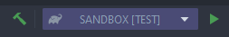

# 3. Functions

## 3.1 Importez le projet

Importez le projet sur IntelliJ IDEA. Pour lancer+compiler :

````sh
gradlew runApp
````

## 3.2 Analyser le projet

```kotlin
package org.example.sandbox

import kotlin.random.Random

enum class Chocolate {
    WHITE, BLACK, MILK
}

fun giveRandomChocolate(seed: Int? = null): Chocolate {
    val choice = seed?.let {
        Random(it).nextInt(Chocolate.values().size)
    } ?: Random.nextInt(Chocolate.values().size)

    return Chocolate.values()[choice]
}

fun main() {
    println(giveRandomChocolate(42))
}
```

Ici, le programme prend un chocolat `WHITE`, `BLACK` ou `MILK`.

- `fun` déclare une fonction
- En paramètres, `seed` est la graine pour le randomiser. Il s'agit d'un argument optionnel et est `null` par défaut.
- En sortie, on obtient un `Chocolate`.

Observons un peu plus en profondeur :

- Au lieu de faire un `if (seed != null)`, on utilise `seed?.let()`. `let` est une méthode qui **prend une fonction en argument** et retourne le résultat de la fonction.

  ```kotlin
public inline fun <T, R> T.let(block: (T) -> R): R {  // <-- block est une fonction avec T en argument (seed) 
      contract {
        callsInPlace(block, InvocationKind.EXACTLY_ONCE)
      }
    return block(this)  // <-- retourne le résultat de la fonction
  }
  ```
  
En effet, il est possible de mettre des fonctions en arguments, car Kotlin traite les fonctions comme des **citoyens de premières classes** (en clair, ce sont des objets).
  
Pour pouvoir mettre une fonction anonyme (qui n'a pas de nom) en argument, on utilise des **lambdas**.
  
  Par exemple :
  
  ```kotlin
{a: Int, b: Int -> a + b}
  ```

  `a` et `b` sont les paramètres de la fonction. Ce que l'on retourne est la **dernière déclaration**.
  
  ```kotlin
  // Exemple d'utilisation
  val value = {a: Int, b: Int -> a + b}(1, 2)
  ```
  
  Autre exemple :
  
  ```kotlin
  val result = { start: LatLng, end: LatLng ->
          val startRad = start.toRadians()
          val endRad = end.toRadians()
  
        val delta = endRad - startRad
          val a = sin(delta.latitude / 2).pow(2) + cos(start.latitude) * cos(end.latitude) * sin(delta.longitude/2).pow(2)
        val c = 2 * asin(sqrt(a))
  
        val earthRadiusInKm = 6371
  
        c * earthRadiusInKm  // Ceci est retourné
      }(start, end)
  ```
  
  `.let` agirait donc de cette manière `object.let({object -> /* Do */ })`. Ce qui est équivalent à `object.let{object -> /* Do */ }`.
  
Quand l'argument de la fonction est unique, il n'est pas obligatoire de spécifier le nom de l'argument. Le nom de l'argument devient `it`.
  
Donc, avec toutes les explications précédentes  : 
  
  ```kotlin
  val choice = seed?.let {
      Random(it).nextInt(Chocolate.values().size)
  } ?: Random.nextInt(Chocolate.values().size)
  ```
  
  est équivalent à :
  
  ```kotlin
  val choice = if (seed != null) {
      Random(seed).nextInt(Chocolate.values().size)
  } else {
      Random.nextInt(Chocolate.values().size)
  }
  ```

## 3.3 Tâche : Calculez le discriminent d'une liste d'équation de degré 2

Vous devez remplir 2 classes :

- La première, `Discriminateur`, doit calculer de discriminant d'une `EquationDegre2`
- Le deuxième, `DiscriminantTransformer`, doit convertir une liste d'équations en une liste de discriminants.

`EquationDegre2` est sous la forme : 

```kotlin
/**
 * Représentation d'une équation de Degre 2
 *
 * L'équation en question :
 * [a] * x.pow(2) + [b] * x + c = y
 */
data class EquationDegre2(val a: Int, val b: Int, val c: Int)
```

Vous accédez à ses propriétés comme ci-dessous :

```kotlin
val equation = EquationDegre2(1, 2, 3)
equation.a  // 1
equation.b  // 2
equation.c  // 3
```

Remplissez la fonction en remplaçant le TODO par votre implémentation.

```kotlin
class Discriminateur : Usecase<EquationDegre2, Double> {
    override operator fun invoke(params: EquationDegre2): Double {
        TODO("Not yet implemented : See https://fr.wikipedia.org/wiki/Discriminant#R%C3%A9solution_de_l'%C3%A9quation_%C3%A0_coefficients_r%C3%A9els")
    }
}
```

```kotlin
class DiscriminantTransformer(private val discriminant: Discriminateur) : Usecase<List<EquationDegre2>, List<Double>> {
    override operator fun invoke(params: List<EquationDegre2>): List<Double> {
        TODO("Not yet implemented : See https://kotlinlang.org/api/latest/jvm/stdlib/kotlin.collections/map.html")
    }
}
```

Pour le premier, je rappelle $\Delta = b^2-4ac$.

Pour le deuxième, vous pouvez utiliser `listOfobjects.map({object -> /* TODO */})` qui convertit une liste d'objet en une nouvelle liste d'objet.

Lances les tests avec :

```sh
gradlew test
```

Ou : 

## Tout a une valeur (sauf les boucles `for` et `while`)

Il est possible d'attribuer le résultat d'une déclaration à une variable.

Exemple :

```kotlin
val isUnit = println("This is an expression")
println(isUnit)
```

```sh
⇒ This is an expression
kotlin.Unit
```

Autre exemple :

```kotlin
val isHot = if (temperature > 50) true else false
```

Autre exemple :

```kotlin
val result: Result<String> = try {
        Result.success(dataSource.fetch())
    } catch (e: Throwable) {
        Result.failure(e)
    }
```

## 3.4 Tâche : Transformer vos fonction en valeur

Peut-être que vous avez écrit :

```kotlin
override operator fun invoke(params: Any): Any {
    return /* CODE */
}
```

Dans ce cas, vous pouvez tout simplement raccourcir la fonction :

```kotlin
override operator fun invoke(params: Any) = /* CODE */
```

Exemple :

```kotlin
fun add(a: Int, b: Int) = a + b
```

## 3.5 Utilisez `when`

Switch-case n'existe pas sur Kotlin. Mais `when` existe et est très puissant pour les fonctionnalités avancées en OOP.

Exemple :

```kotlin
val food = when (day) {
    "Monday" -> "flakes"
    "Tuesday" -> "pellets"
    "Wednesday" -> "redworms"
    "Thursday" -> "granules"
    "Friday" -> "mosquitoes"
    else -> "nothing"
}
```

`when` fonctionne avec tout tant qu'il y a une condition.

```kotlin
when (x) {
    in 1..10 -> print("x is in the range")
    in validNumbers -> print("x is valid")
    !in 10..20 -> print("x is outside the range")
    else -> print("none of the above")
}
```

```kotlin
when (x) {
    0, 1 -> print("x == 0 or x == 1")
    else -> print("otherwise")
}
```

```kotlin
fun Request.getBody() =
        when (val response = executeRequest()) {
            is Success -> response.body
            is HttpError -> throw HttpException(response.status)
        }
```


## 3.6 Tâche : Ranger les chocolats dans l'ordre

Dans le fichier `ChocolateDrawer.kt`, remplisser la fonction `fillIn` de telle sortes à ce que l'entrée `chocolates` soit répartie en 3 listes.

```kotlin
package org.example.sandbox

data class ChocolateDrawer(
    val blackChocolates: MutableList<Chocolate>,
    val whiteChocolates: MutableList<Chocolate>,
    val milkChocolates: MutableList<Chocolate>
) {
    fun fillIn(chocolates: List<Chocolate>) {
        TODO("Not yet implemented. Use 'when' and 'forEach'")
    }
}
```

Exécutez `gradlew test` pour vérifier.

## 3.7 Tâche : Eager ou Lazy

Souvent, on se demande si l'exécution d'une fonction `.map`, et toute autre fonction parcourant une liste, est exécuté à la déclaration de la variable (*eager*) ou à l'appel de la variable (*lazy*).

Dans le main, testez simplement :

```kotlin
val list = listOf("Hello", "World", "!").map {
    println(it)
    it
}
```

Exécutez-le `gradlew runApp`.

```sh
MILK
Hello
World
!
```

`map` s'est exécuté à la déclaration de la variable ! Les listes sont donc *eager* par défaut.

Pour le rendre *lazy*, on peut utiliser `sequenceOf(..)` ou convertir avec `asSequence()`.

```kotlin
val sequence = sequenceOf("Hello", "World", "!").map {
    println(it)
    it
}
```

Exécutez-le `gradlew runApp`.

```sh
MILK
```

`map` ne s'est pas exécuté ! Pour l'exécuté, appelez la variable.

```kotlin
sequence.forEach { println(it) }
```

Ou convertissez la en *eager*.

```kotlin
sequence.toList()
```

Exécutez-le `gradlew runApp`.

```sh
BLACK
Hello
Hello
World
World
!
!
```

`map` s'est donc exécuté à l'appel de la méthode `.forEach` ou `toList()`

## 3.8 Tâche : Pratiquer les lambdas

Les lambdas sont très fréquent sur Kotlin étant donnée que ce sont des citoyens de première classe.

Pour qu'une fonction accepte un lambda, on utilise cette notation :

```kotlin
// Declaration
fun updateDirty(dirty: Int, operation: (Int) -> Int): Int {
   return operation(dirty)
}

// Usage
updateDirty(30, { dirty -> dirty / 2 })
```

Pour faire passer une fonction, on utilise `::` :

```kotlin
// Usage
fun waterFilter( dirty: Int ) = dirty -> dirty / 2

println(updateDirty(15, ::waterFilter))
```

Kotlin possède une fonctionnalité supplémentaire permettant d'avoir un syntaxe plus concise appelé *syntaxe d'appel du dernier paramètre*.

Cela signifie qu'il est possible d'extraire le dernier lambda (*trailing lambda*) en paramètre et le placer en dehors des parenthèse.

Soit :

```kotlin
updateDirty(30) { dirty -> dirty / 2 }
```

